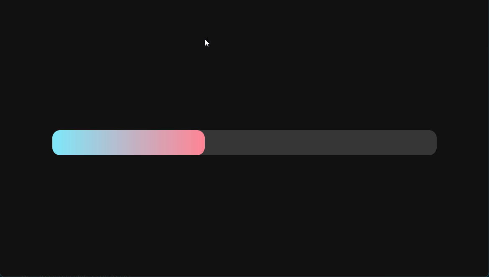

## PROGRESS BAR GRADIENT

<div align="left">



#
## Проект сожержит
<details>
  <summary>SCSS</summary>
 
  [Что это?](https://sass-scss.ru/)  

    Вы можете изменять  настройки в вашем проекте. 
    Для  автоматического комполирования файлов css необходимо запустить 

  Live Sass Compiler 

  [Что это?](https://marketplace.visualstudio.com/items?itemName=ritwickdey.live-sass)  


</details>


# 
## Для запуска потребуется
- этот репозиторий 
 ```
git clone https://github.com/VladislavBobyrev/progress-bar-gradient
```
<!-- - node.js 
 
```
https://nodejs.org/en/
``` -->

- Live Sass Compiler

 
```
https://marketplace.visualstudio.com/items?itemName=ritwickdey.live-sass
```

- браузер

<!-- #
## Команды

|                        |                       |
|------------------------|:----------------------|
| Установить зависимости | `npm i`               |
| Запустить локально     | `npm run serve`       |
| Собрать                | `npm run build`       | -->
 
#
## Связвться со мной
<div align='center'> 
 
 ```
vladislavbobyrev@yandex.ru
```
 
 [](https://t.me/VladislavBobyrev)

 </div>
 
<div align="center">
  <h2>**ВНИМАНИЕ!**  Вся конфигурация является открытой. </h2>
 
**ВНИМАНИЕ!** На компьютере должны быть установлены программы `node` и `npm`.
Генерация  занимает много времени за счёт
установки `node_modules`. Необходимо дождаться окончания этого процесса.
 
</div>
